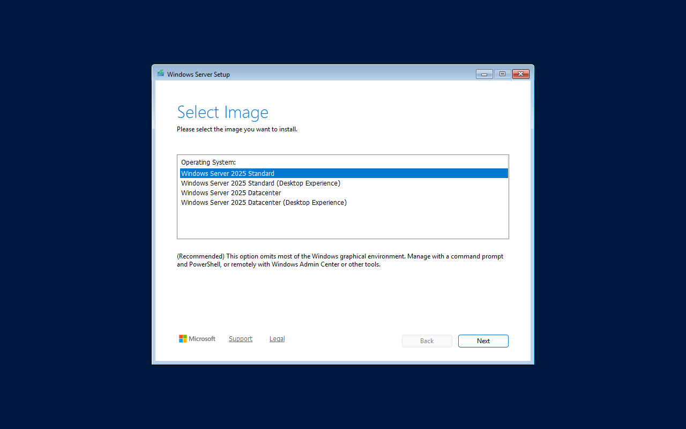

# Configuration

Three files, all in the repository root (the weekly task runs from `Y:\src\Customize-WindowsIso`):

| File | Says | Changing it |
|---|---|---|
| `config.json` | what is done **to the images**: profiles, Setup bypasses, output format, disk picker | rebuilds every ISO on the next run |
| `runner-config.json` | **where** things are on the build box, driver sets, Office/Defender/WinGet caches, switches | depends on the setting |
| `ci\ci-config.json` | the **install tests**: Proxmox node, VM size, expectations | nothing is rebuilt |

Plus `autounattend.xml` (the answer file on every ISO) and `.postinstall\office\configuration.xml`
(which Office is installed).

## `config.json`

```json
{
  "boot":    { "LabConfig": { "BypassTPMCheck": true, "BypassSecureBootCheck": true, "BypassRAMCheck": true, ... } },
  "iso":     { "NoPrompt": true, "DiskPicker": true, "DiskPickerMinSizeGB": 50 },
  "install": { "Format": "esd", "ExportWim": true, "DefenderUpdate": true, "UpdateWinGet": true,
               "ProfileRules": [ ... ], "Profiles": { ... } }
}
```

| Setting | Default | Does |
|---|---|---|
| `boot.LabConfig.*` | TPM, Secure Boot, RAM on | Windows 11 Setup's hardware-check bypasses, written into the Setup image (`boot.wim`). CPU and storage checks are off. |
| `iso.NoPrompt` | `true` | UEFI boot doesn't wait for "press any key to boot from CD". **The ISO then reinstalls on any machine it's left attached to**: remove it after Setup. |
| `iso.DiskPicker` | `false` (on in this config) | Choose the install disk in WinPE instead of wiping disk 0 ([disk picker](disk-picker.md)). |
| `iso.DiskPickerMinSizeGB` | `50` | Smallest disk the picker uses without asking. |
| `install.Format` | `esd` | `esd`: `install.esd` with LZMS compression, ~20 % smaller, 2.5x slower to build. `wim`: `install.wim`. |
| `install.ExportWim` | `true` | With `wim`, re-export after servicing (smaller). |
| `install.DefenderUpdate` | `true` | Put the current Defender platform, engine and signatures into every image. |
| `install.UpdateWinGet` | `true` | Provision the current WinGet (App Installer) into every image that has AppX. |

### Profiles: what each edition gets

A **profile** says what is removed from an image and which registry settings it gets. Every
edition in an ISO gets one, chosen by `install.ProfileRules`.

```json
"ProfileRules": [
  { "InstallationType": "Server*", "Profile": "plain" },
  { "InstallationType": "Client",  "Profile": "client-default" }
],
"Profiles": {
  "plain":          { "Description": "...", "Packages": {}, "Registry": [] },
  "client-default": { "Packages": { "AppXPackagesToRemove": [...], "WindowsCapabilitiesToRemove": [...] },
                      "Registry": [ { "Name": "Widgets", "Enabled": true, "Values": [ ... ] }, ... ] },
  "client-minimal": { "Extends": "client-default", "Packages": { ... }, "Registry": [ ... ] }
}
```

The profiles that ship:

| Profile | What it does | Used for |
|---|---|---|
| `plain` | nothing removed, no registry changes | Windows Server (Desktop Experience and Core) |
| `client-default` | ads, consumer and retired apps removed (Clipchamp, Bing News/Weather, Copilot, Solitaire, Family, Dev Home, Maps, Mail and Calendar...); sponsored content, Start and Search suggestions, Widgets and mouse acceleration off; Microsoft 365 Apps at first logon | Windows 11 |
| `client-minimal` | `client-default` plus most inbox apps (Camera, Clock, Sticky Notes, Sound Recorder, Feedback Hub, Get Help, Quick Assist, Phone Link, Teams, new Outlook, To Do, Power Automate, Xbox components), legacy Media Player and PowerShell ISE; Game DVR off; telemetry at Required | not used by default |

**Rules**: the first rule whose conditions all match wins. Conditions are case-insensitive
wildcards on `IsoName` (the source ISO's file name), `ImageName` (the edition, e.g.
`Windows 11 Pro`) and `InstallationType` (`Client`, `Server`, `Server Core`). An edition no
rule matches fails the build. For example, to strip the Insider image harder:

```json
"ProfileRules": [
  { "InstallationType": "Server*", "Profile": "plain" },
  { "IsoName": "*Insider*",        "Profile": "client-minimal" },
  { "InstallationType": "Client",  "Profile": "client-default" }
]
```

**A profile**:

- `Packages.AppXPackagesToRemove`, `WindowsCapabilitiesToRemove`, `WindowsPackagesToRemove`:
  names, wildcards allowed. `Get-AppxProvisionedPackage -Online`, `Get-WindowsCapability -Online`
  and `Get-WindowsPackage -Online` on a reference machine list what there is.
- `Registry`: groups of values, each `{ Name, Description, Enabled, Values }`; each value is
  `{ Hive, Key, Name, Type, Data }` or `{ Hive, Key, [Name], Delete: true }`. `Hive` is
  `SOFTWARE` (HKLM\SOFTWARE), `SYSTEM` (HKLM\SYSTEM) or `DEFAULTUSER` (the default user profile,
  copied to every new user). `Type` is `REG_DWORD`, `REG_SZ`, etc.
- `Extends`: start from another profile. Package lists are added together; a registry group with
  the same `Name` replaces the inherited one, so `{ "Name": "Widgets", "Enabled": false }` turns
  an inherited group off.

The manifest (`<name>.iso.json`) and the index page record which profile each edition got.

> Windows rewrites a few per-user values at first logon whatever the default profile says
> (`ContentDeliveryAllowed` and the `Subscriptions` key, on 25H2 and later), so those two don't
> stick; everything set by policy (`SOFTWARE\Policies\...`) does. The install tests report it.

### The answer file

`autounattend.xml` is copied to the root of every ISO. It sets the language (en-US) and time
zone, accepts the licence, skips OOBE, wipes and partitions disk 0 (unless the disk picker is on),
runs the [specialize and first-logon stubs](post-install-scripts.md), and picks the edition for
single-edition media. On multi-edition media (the Server ISOs with Standard/Datacenter, Core/Desktop
Experience) the edition choice is removed, so Setup asks:



## `runner-config.json`

| Setting | Here | Does |
|---|---|---|
| `InputDirectory` | `Y:\Images\Standard` | Get-WindowsIso's output: the ISOs to customize |
| `OutputDirectory` | `Y:\Images\Customized` | the share |
| `WorkingDirectory` | `Y:\IsoBuild\Customize` | scratch space (about 3x the ISO size + 20 GB) |
| `LogDirectory` | `Y:\IsoBuild\Logs` | logs and run summaries |
| `KeepPrevious` | `true` | keep last week's ISO as `<name>.previous.iso` |
| `PostinstallSource` | `""` (the repo's `.postinstall`) | the folder that goes on the post-install media as `.postinstall`. Point it at a private folder on the build box for client scripts with credentials: **the repository is public**. It needs the same layout (`specialize`, `oobe`, `office\configuration.xml`). |
| `BuildPostinstallIso` | `true` | build `postinstall-client.iso` / `postinstall-server.iso` |
| `PostinstallFolder` | `...\Customized\postinstall` | the client media as a folder, for USB/Ventoy |
| `BuildIndex` | `true` | write `index.html` / `index.json` on the share |
| `DeleteSourceAfterBuild` | `false` | delete source ISOs once their output is current (saves ~60 GB, but any config change then means downloading everything again) |
| `DriverSets` | VirtIO | drivers added to the images (below) |
| `Office` | cache `Y:\IsoBuild\Cache\office` | keep the newest Microsoft 365 Apps build for the post-install media |
| `Defender` | cache `Y:\IsoBuild\Cache\defender` | Defender update kit; `RebuildOnSignatureUpdate` rebuilds on every new signature kit |
| `WinGet` | cache `Y:\IsoBuild\Cache\winget` | current stable WinGet release |
| `LogRetentionDays` | `90` | prune old logs |

### Driver sets

Storage and network drivers that Windows doesn't have inbox (virtio-scsi, Intel RST/VMD, some
RAID/NVMe) have to be in Setup's image, the installed image and the recovery image, or Setup
won't see the disk:

```json
"DriverSets": [
  { "Name": "VirtIO", "Type": "virtio-iso", "Path": "Y:\\IsoBuild\\Cache\\virtio-win.iso",
    "Drivers": ["vioscsi", "viostor", "NetKVM"], "Targets": ["boot", "install", "winre"] },
  { "Name": "Storage", "Type": "folder", "Path": "Y:\\IsoBuild\\Drivers\\Storage",
    "Targets": ["boot", "install", "winre"], "Enabled": false }
]
```

- `virtio-iso`: a [virtio-win](https://fedorapeople.org/groups/virt/virtio-win/direct-downloads/archive-virtio/)
  ISO; the right OS folder (`w11`, `2k22`, `2k25`) is used per image. Download a new release with
  a direct file link (the directory listing is behind a browser check) and put it at `Path`.
- `folder`: a folder of drivers, e.g. `pnputil /export-driver * <dir>` from a machine of the model.
  OS subfolders (`w11`, `2k22`, ...) are used per image if present. Keep it to storage and network
  drivers: everything in it goes into every target.

Replacing the virtio-win ISO or changing a driver folder rebuilds every ISO.

## `.postinstall\office\configuration.xml`

The [Office Deployment Tool](https://learn.microsoft.com/microsoft-365-apps/deploy/office-deployment-tool-configuration-options)
configuration: product, channel, languages, excluded apps. The runner downloads the newest build of
that channel/edition/language set each week; the first-logon script installs it. Changing the
product needs no new download; changing channel, edition or languages does (the next run does it).
