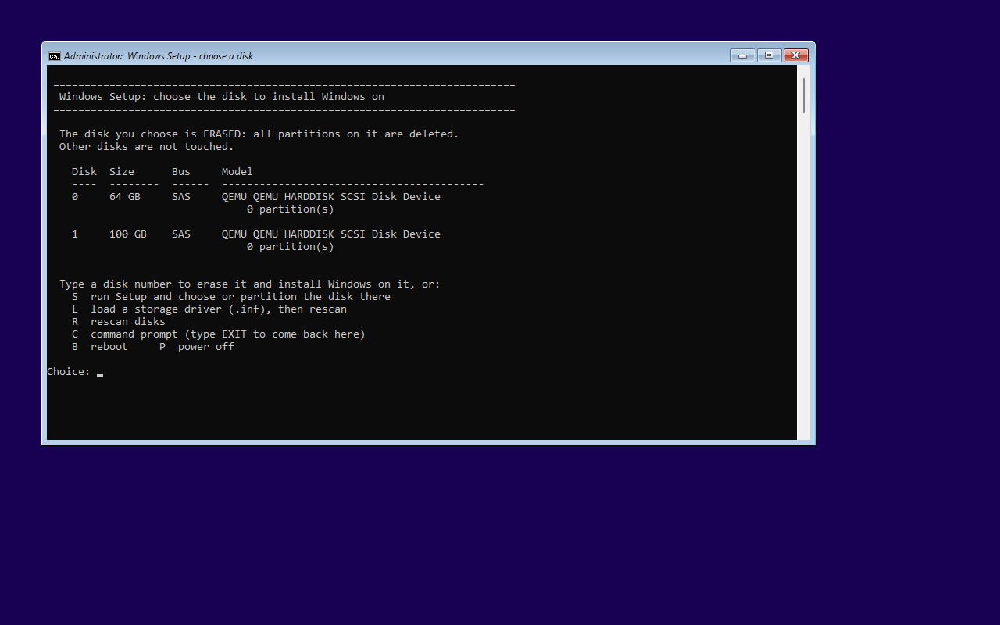
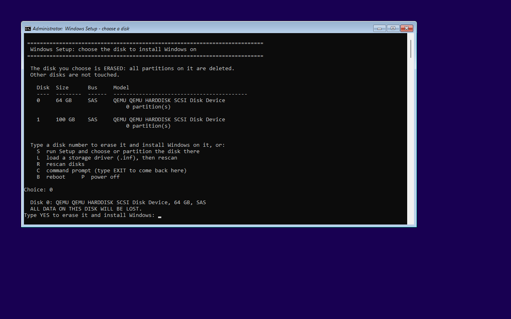
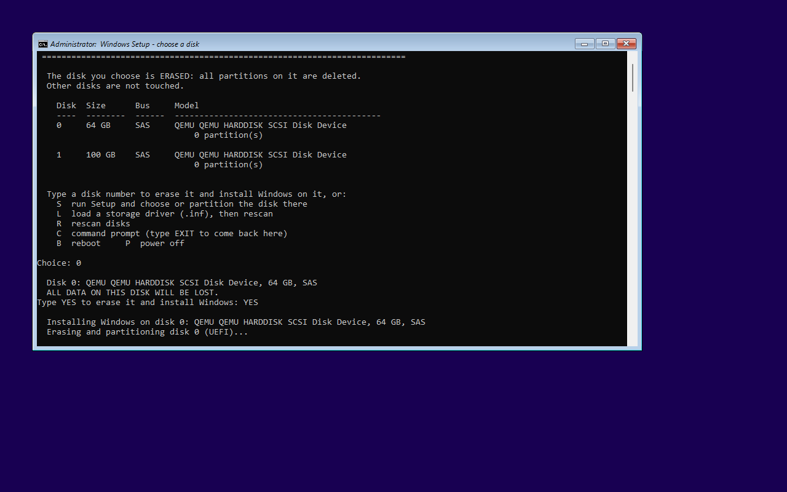
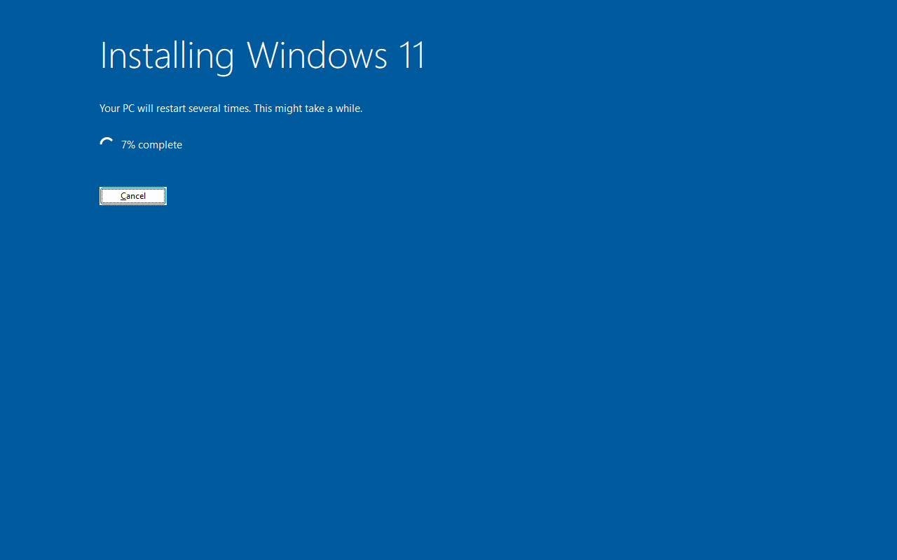

# The disk picker

Without it, the answer file **wipes disk 0** and installs there, without asking. That's fine for
single-disk machines and VMs, and dangerous on anything with a second disk, where disk 0 isn't
necessarily the one you think.

With `iso.DiskPicker` set to `true` in `config.json`, Setup's WinPE runs `winpe\diskpicker.cmd`
first (via `winpeshl.ini` in `boot.wim`), which looks at the disks:

| Disks found | What happens |
|---|---|
| exactly one internal disk of at least `iso.DiskPickerMinSizeGB` (50 GB) | it's wiped and Windows installed on it, **no questions**: single-disk machines and VMs stay fully unattended |
| several | a **menu** (below) |
| none | an explanation (usually a missing storage driver) and a way to load one |

It's off by default; the weekly ISOs are built without it until you switch it on.

## The menu



Every disk Windows could go on is listed with its number, size, bus type and model, and below it
the number of partitions and the volumes on it (letter, label, file system, size), so you can tell
the empty new SSD from the old disk with data. Smaller disks (e.g. a 16 GB Optane module) are listed
but never picked automatically.

**Never offered** (listed under *Not available* with the reason): USB and SD disks, the disk the
install media is on (it has `\sources\boot.wim`), Ventoy drives, disks without media.

Type a disk number and Enter, then confirm with `YES`:



Anything other than `YES` goes back to the menu. Then it partitions the disk and starts Setup:



The other keys:

| Key | |
|---|---|
| `S` | run Setup without a disk: Setup shows its own disk page, where you can partition by hand |
| `L` | load a storage driver: type the path of its `.inf` (e.g. `E:\drivers\vioscsi\w11\amd64\vioscsi.inf`), then it rescans |
| `R` | rescan the disks |
| `C` | a command prompt (`diskpart`, `notepad X:\DiskPicker\work\diskpicker.log`...); `EXIT` comes back |
| `B` / `P` | reboot / power off |

## What it does to the disk

The chosen disk gets the same layout the answer file would have given disk 0:

| Booted in | Layout |
|---|---|
| UEFI | GPT: EFI system partition 260 MB (FAT32), MSR 16 MB, Windows (NTFS, the rest) |
| BIOS (legacy) | MBR: system partition 100 MB (NTFS, active), Windows (the rest) |

Then Setup runs with a copy of the ISO's answer file that points `InstallTo` at that disk, and the
install continues unattended:



Other disks are not touched.

> **Boot order.** After Setup, the machine has to boot from the disk Windows went on. Setup sets
> that up on physical machines (a *Windows Boot Manager* firmware entry). On a Proxmox VM, the VM's
> boot order decides: if Windows went on a disk that isn't in it, the VM boots the ISO again and the
> picker asks again. Pick the disk that's first in the boot order, or add the other one.

## When there's no disk

> No disk was found that Windows can be installed on.

Setup has no driver for the storage controller: Intel RST/VMD or RAID on PCs (switch the
controller to AHCI in the firmware if you can), some NVMe and RAID controllers, virtio on VMs
installed from an ISO without the VirtIO driver set. `L` loads the driver from a stick, or `S` lets
Setup's own page do it (*Load driver*). For good, add the driver to a
[driver set](configuration.md#driver-sets) so it's in every ISO.

## Turning it on

```json
"iso": { "NoPrompt": true, "DiskPicker": true, "DiskPickerMinSizeGB": 50 }
```

in `config.json`; the next run rebuilds every ISO. The ISO's own `autounattend.xml` then has no disk
settings at all, so if Setup ever starts without the picker it asks for the disk instead of wiping
one.

## Under the hood

- It's a `cmd` script: the Setup image has no PowerShell on Server 2022, and no `findstr`,
  `choice` or `wmic`, so the menu is typed rather than arrow-driven. It parses `diskpart` output
  (English media only).
- `Customize-Iso.ps1` puts `diskpicker.cmd`, `winpeshl.ini`, `settings.cmd` (the minimum size)
  and the answer file split into `unattend-head.xml` / `unattend-tail.xml` (around `<InstallTo>`)
  into the Setup image (`boot.wim` index 2, `X:\DiskPicker`).
- Log: `X:\DiskPicker\work\diskpicker.log` (until the reboot).
- `winpe\tests\Test-DiskPicker.ps1` runs it against recorded `diskpart` output in a test mode that
  never partitions anything.
