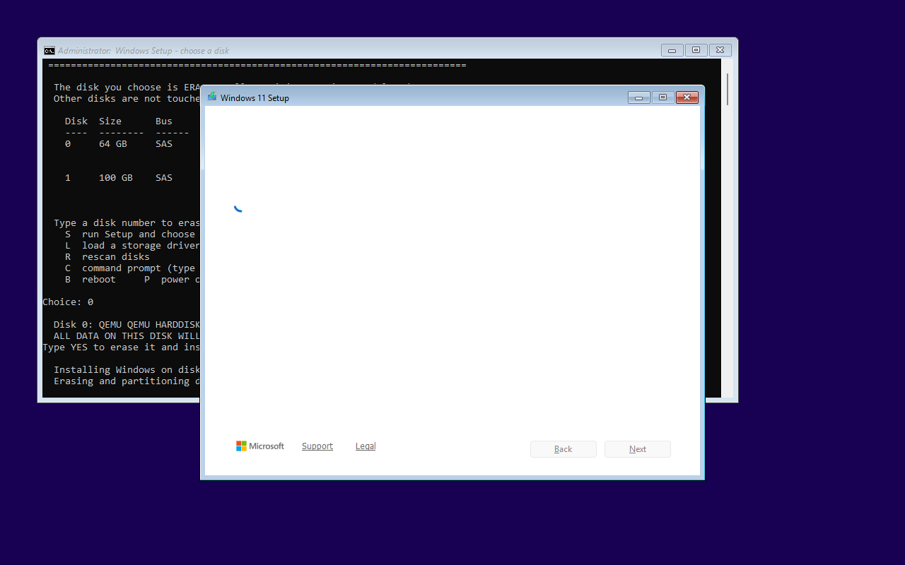
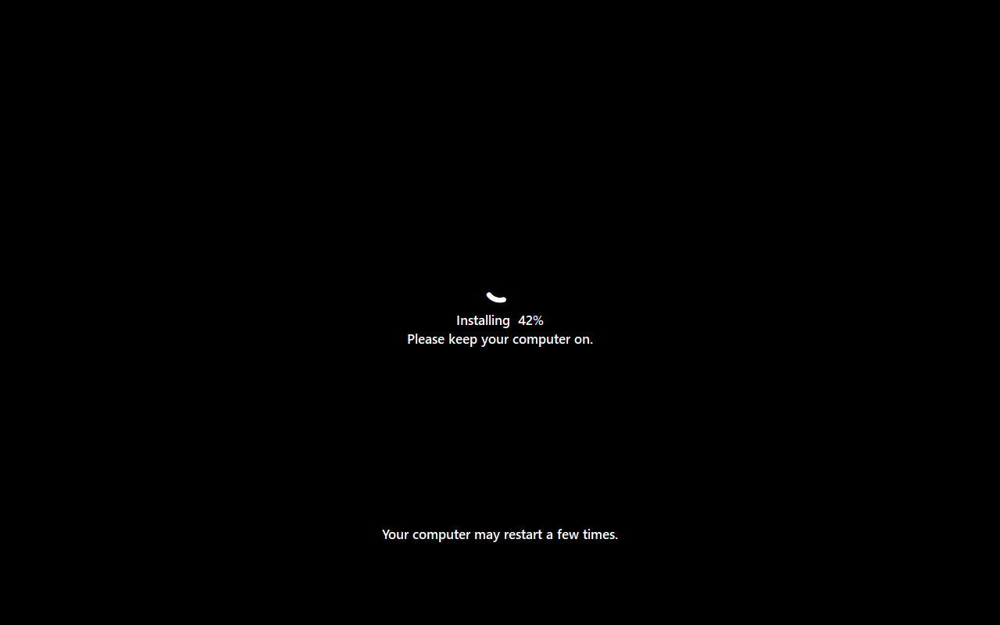
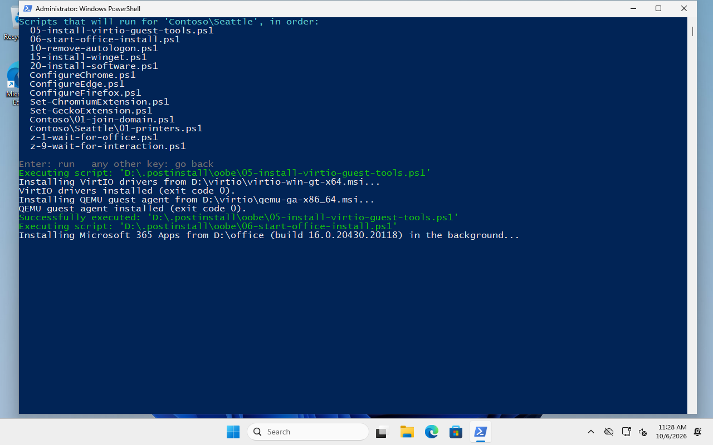
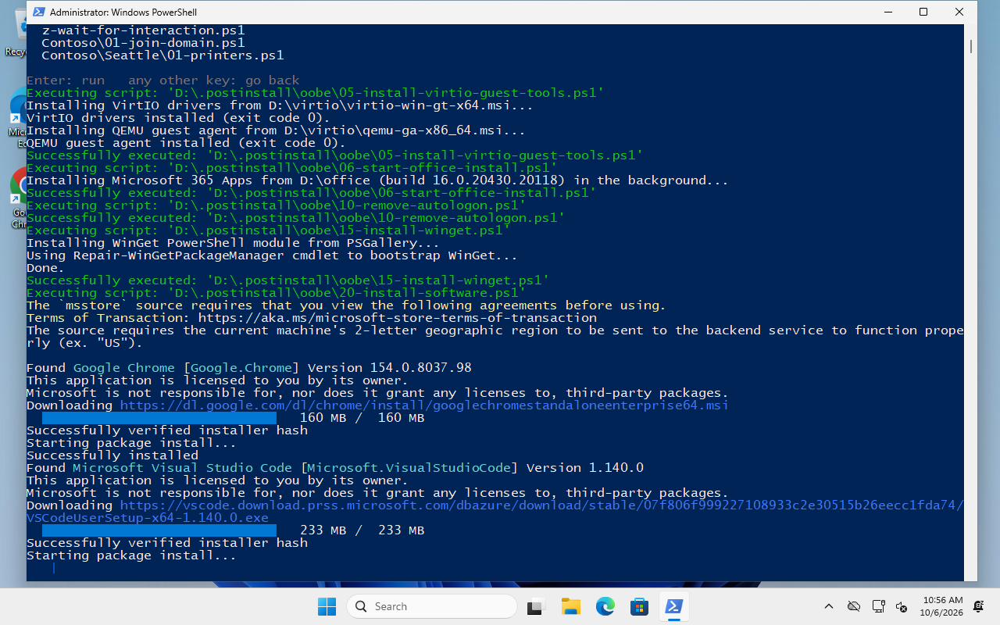
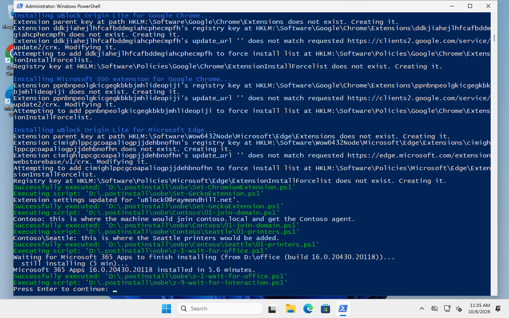
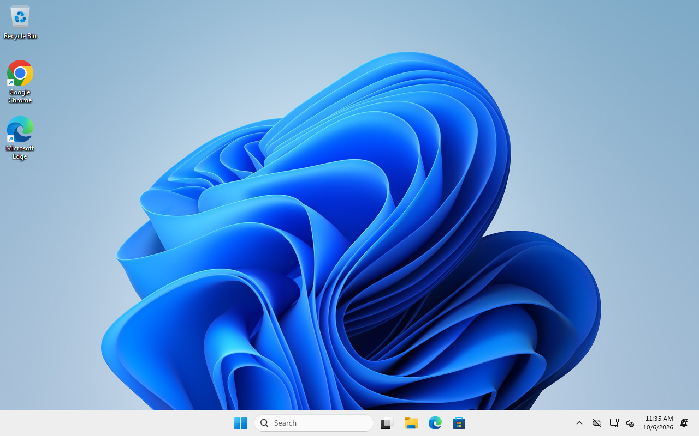
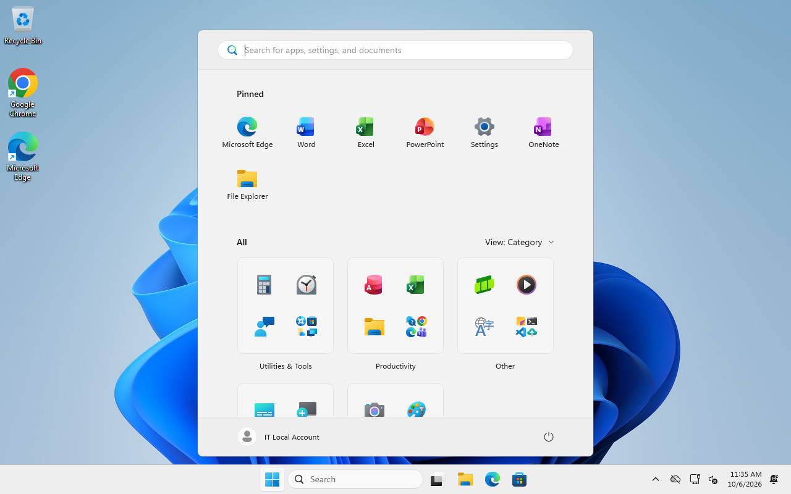

# An install, step by step

A real install of `Windows11Professional,version26H2.iso` on a Proxmox VM, from boot to the
desktop, with the screens a technician sees. This ISO was built with the
[disk picker](disk-picker.md) on, and the VM has two disks, so the picker shows its menu. The
post-install media has the repository's scripts plus two demo clients, *Contoso* (with sites
*Seattle* and *Denver*) and *Fabrikam*.

```text
.postinstall\oobe\
  05-install-virtio-guest-tools.ps1 ... z-9-wait-for-interaction.ps1   (the common scripts)
  Contoso\01-join-domain.ps1
  Contoso\Seattle\01-printers.ps1
  Contoso\Denver\01-printers.ps1
  Fabrikam\01-rmm-agent.ps1
```

Total time: about 25 minutes, of which the technician is needed for about one: pick the disk,
confirm, press Enter after specialize, pick the client, press Enter at the end.

## 1. Boot

The ISO boots straight into Setup, with no "press any key to boot from CD" (`iso.NoPrompt`).
That's convenient, and it's why the ISO has to come out after the install.

## 2. Choose the disk (disk picker)

With more than one disk, the picker lists them:


Type the number of the disk to install on, then `YES`:


It partitions the disk (GPT: EFI, MSR, Windows) and starts Setup with the answer file pointed at
it:




On a machine with exactly one suitable disk none of this shows: the picker uses it without
asking. Without the disk picker, disk 0 is wiped without asking. See [the disk picker](disk-picker.md).

## 3. Setup copies Windows

Unattended: the language, licence and edition come from `autounattend.xml`. Multi-edition media
(the Server ISOs) stop here to ask for the edition ([configuration](configuration.md#the-answer-file)).


The VM reboots into the installed Windows after about 5 minutes.

## 4. Specialize: the specialize scripts

After the reboot Windows finishes installing ("Installing NN %"). Partway through, the specialize
stub finds `.postinstall\specialize` on the post-install drive and runs it as SYSTEM, in a console
over Setup's screen:




`10-create-user.ps1` creates the local admin and turns on autologon. The sample's last script,
`z-wait-for-interaction.ps1`, waits for **Enter** so you can read the output; Setup continues
after it. Delete that script for fully unattended installs.

OOBE (region, keyboard, network, account, privacy) is skipped entirely, and Windows signs in the
local admin by itself.

## 5. First logon: pick the client

The first-logon stub opens a PowerShell console and shows the client picker. (Windows 11 opens the
Start menu at the first sign-in, on top of it and with the keyboard focus; the picker closes it
again, so the keys reach the menu.)


Arrow keys to move, Right to expand a client into its sites:


Enter shows exactly what will run, in order: the common scripts, Contoso's, Seattle's, and last the
`z-*` scripts (waiting for Office, the final pause). Enter again to run, any other key to go back:


## 6. First logon: the scripts run

The VirtIO drivers and the QEMU guest agent install (on Proxmox VMs only), and Office starts
installing in the background:



WinGet installs the software from `20-install-software.ps1` while Office installs:



(VS Code's own installer window pops up briefly: it's a per-user installer.) Then the browser
policies and extensions, Contoso's and Seattle's scripts, and last the `z-*` scripts: wait for
Office to finish (5-8 minutes from a local SSD, overlapping everything above), and the final
**Press Enter**:



## 7. Done





The machine has Windows 11 with the current cumulative update, Defender and WinGet; the
profile's removals and settings; the VirtIO guest tools; Microsoft 365 Apps; Chrome and VS Code;
and whatever the client and site scripts did. Autologon is off again (`10-remove-autologon.ps1`).

Remove the ISO (and the stick, or the VM's DVDs) before the next reboot. Then the RMM agent takes
over: it rotates the local admin's password, and so on.
