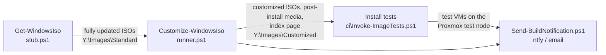

# How it fits together

Customize-WindowsIso turns stock Windows ISOs into install media that:

- install **unattended**: no edition, language, licence or disk questions (or, with the disk
  picker, one menu when a machine has more than one disk), no OOBE, no Microsoft account;
- are **current** every week: the latest cumulative update (from Get-WindowsIso), the current
  Microsoft Defender platform, engine and signatures, and the current WinGet;
- are **trimmed** per edition: ads, consumer apps and retired features removed from Windows 11,
  Windows Server left alone ([profiles](configuration.md#profiles-what-each-edition-gets));
- **boot and install on VMs and odd hardware**: VirtIO storage and network drivers in Setup, the
  installed Windows and WinRE ([driver sets](configuration.md#driver-sets)); Windows 11's TPM,
  Secure Boot and RAM checks bypassed;
- hand over to **your own scripts** after Setup, from a USB stick, a Ventoy drive or a second
  virtual DVD: create the local admin, join the domain, install the RMM agent, Office, printers...
  per client and per site ([post-install scripts](post-install-scripts.md)).

## The weekly pipeline

One scheduled task (`Weekly Windows Image Build`, Wednesdays 01:00, as SYSTEM) runs the four
steps in order ([weekly pipeline](weekly-pipeline.md)):

1. **Get-WindowsIso** ([its own repo](https://github.com/hpst3r/Get-WindowsIso)) builds
   fully-updated ISOs from uupdump into `Y:\Images\Standard` when Microsoft has published a new
   build.
2. **`runner.ps1`** customizes every ISO that changed (new build, or a change to the
   configuration, scripts, drivers, Defender or WinGet) into `Y:\Images\Customized` (the SMB
   share `Customized`), keeps last week's copy as `<name>.previous.iso`, rebuilds the
   post-install media and writes the index page.
3. **The install tests** install every new ISO in a throwaway VM on the Proxmox test node and
   check the running machine ([install tests](install-tests.md)).
4. **The notification** reports all of it on ntfy and/or by email.

## What's on the share

`\\<build box>\Customized` (`Y:\Images\Customized`):

| File | What it is |
|---|---|
| `index.html` | The overview: every ISO with its editions, build, size, SHA-256, what was removed, warnings, last build status and last install test. Open it in a browser straight from the share. |
| `<name>.iso` | A customized ISO, e.g. `Windows11Professional,version26H2.iso`. Boot it, or put it on a Ventoy drive. |
| `<name>.iso.json`, `.iso.sha256.txt` | Its manifest (everything that was done to it) and checksum. |
| `<name>.previous.iso` | Last week's build of the same ISO, in case this week's is bad. |
| `postinstall-client.iso` | The post-install media for client VMs: scripts, VirtIO guest tools, Microsoft 365 Apps (~3.7 GB). Attach as a second DVD. |
| `postinstall-server.iso` | The same without Office (~30 MB), for server VMs. |
| `postinstall\` | The client media as a folder (`.postinstall`, `office`, `virtio`), to copy to the root of a USB stick or Ventoy drive ([media](media.md)). |

## What happens when a machine is installed

The [walkthrough](install-walkthrough.md) shows every step with screenshots. In short:

| Phase | What runs | Who |
|---|---|---|
| Boot | The ISO boots without "press any key" (UEFI). | firmware |
| WinPE | With the disk picker: choose the disk if there is more than one ([disk picker](disk-picker.md)). Otherwise disk 0 is wiped. | `winpe\diskpicker.cmd` |
| Setup | Windows is copied to disk; language, edition and licence come from `autounattend.xml`. | Windows Setup |
| specialize | `C:\postinstall-specialize-stub.ps1` runs `.postinstall\specialize\*.ps1` from the post-install drive, as SYSTEM, before anyone has logged on: typically, create the local admin and turn on autologon. | stub, as SYSTEM |
| OOBE | Skipped entirely by the answer file. | Windows |
| First logon | Autologon signs in the local admin, and `C:\postinstall-oobe-stub.ps1` runs `.postinstall\oobe\*.ps1` in a console: shows the client picker if there are client folders, then runs the scripts (guest tools, Office, WinGet software, client and site scripts...). | stub, as the admin, elevated |

## Repository layout

| Path | What |
|---|---|
| `Customize-Iso.ps1` | Customizes one ISO. |
| `runner.ps1`, `runner-config.json` | Customizes everything in the input folder that changed; the build box's paths and switches. |
| `config.json` | What is done to the images: profiles, registry settings, Setup bypasses, output format, disk picker. |
| `autounattend.xml` | The answer file put on every ISO. |
| `stub-scripts\` | The two stubs copied into every image (`C:\postinstall-*-stub.ps1`). |
| `.postinstall\` | The post-install scripts that go on the post-install media; edit these. `office\configuration.xml` says which Office is installed. |
| `winpe\` | The disk picker (`diskpicker.cmd`, `winpeshl.ini`) and its tests. |
| `New-PostinstallIso.ps1`, `Copy-PostinstallMedia.ps1` | Build the post-install ISOs/folder; copy them to a USB/Ventoy drive. |
| `OfficeKit.ps1`, `DriverSets.ps1`, `Profiles.ps1` | Office download cache, driver sets, profiles (used by the scripts above). |
| `Test-CustomizedIso.ps1` | Checks a built ISO offline (mounts it read-only). |
| `ci\` | The install tests on Proxmox. |
| `New-ImageIndex.ps1`, `Send-BuildNotification.ps1`, `Set-NotificationSecret.ps1` | The share's index page, notifications and their secrets. |
| `register-task.ps1` | Registers the weekly task. |
| `PLAN.md` | What's done, what's open, and gotchas learned the hard way. |
