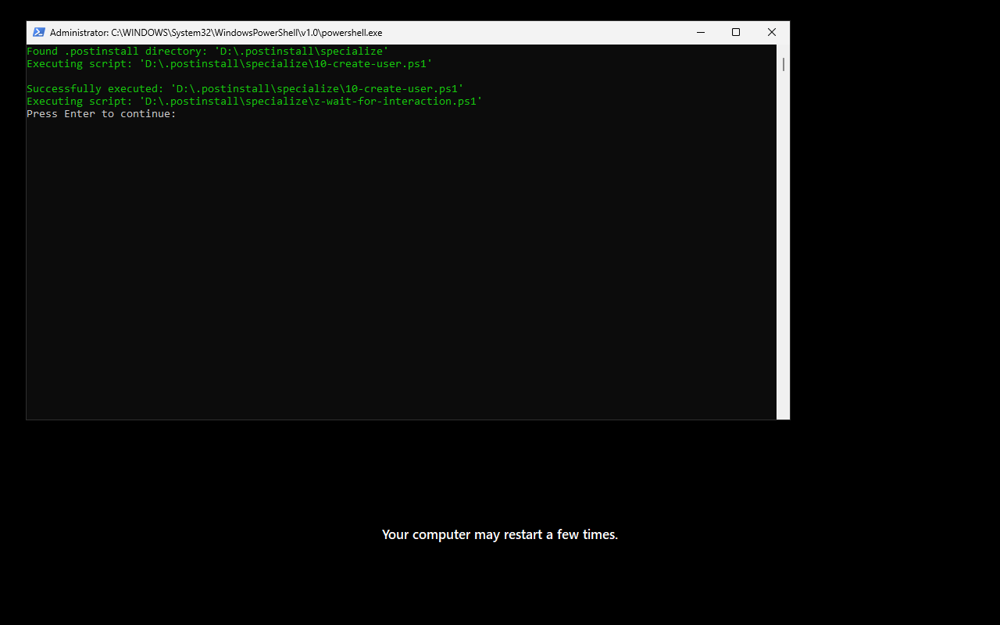
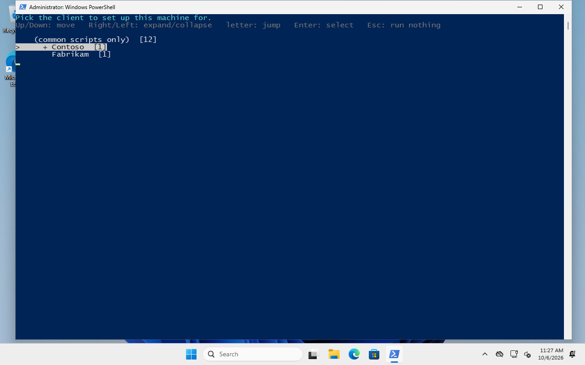
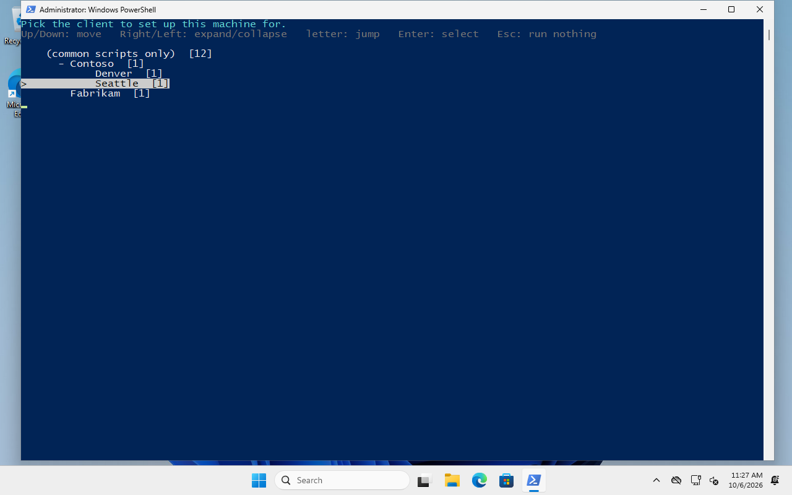
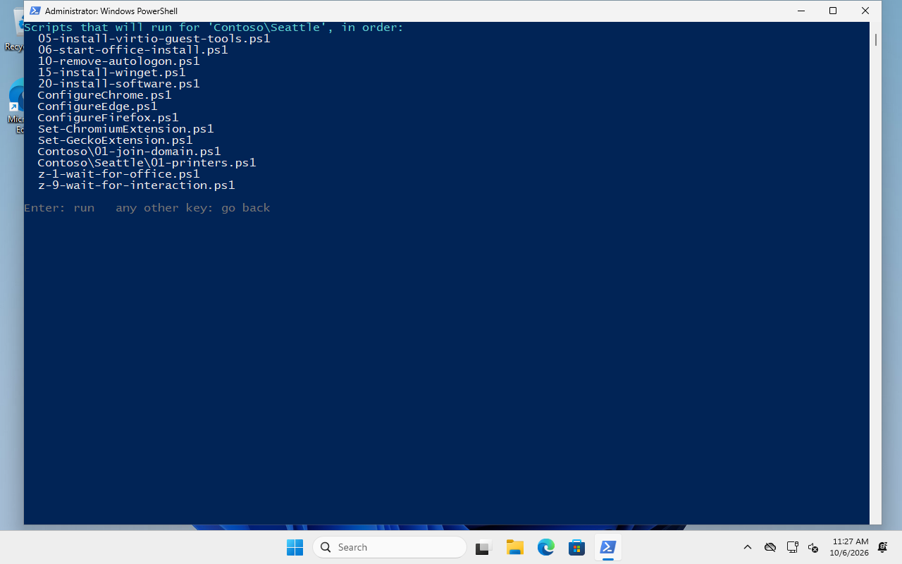

# Post-install scripts

The ISOs don't contain your scripts. They contain two small **stubs** that look for a
`.postinstall` folder at the root of any drive and run what's in it. That keeps the images
generic and lets you change the scripts without rebuilding anything: edit the files on the USB
stick (or rebuild the post-install ISO for VMs) and the next install uses them.

```text
<drive>:\
  .postinstall\
    specialize\         run during Setup's specialize pass, as SYSTEM
      10-create-user.ps1
    oobe\               run at the first logon, as the local admin (elevated), with a console
      05-install-virtio-guest-tools.ps1
      06-start-office-install.ps1
      10-remove-autologon.ps1
      ...
      Contoso\          a client: picked from a menu at first logon
        01-join-domain.ps1
        Seattle\        a site of that client
          01-printers.ps1
    office\
      configuration.xml what Microsoft 365 Apps installs (see Office below)
  office\               the Office installer and files (~3.7 GB), on client media
  virtio\               the VirtIO guest tools, on all media
```

How the stubs get there and when they run:

| Stub | Copied to | Started by | Runs | As |
|---|---|---|---|---|
| `stub-scripts\postinstall-specialize-stub.ps1` | `C:\postinstall-specialize-stub.ps1` (via `sources\$OEM$\$1` on the ISO) | `autounattend.xml`, specialize pass, `RunSynchronous` | every `*.ps1` in `.postinstall\specialize`, by name | SYSTEM, in a console over Setup's progress screen, before any user exists; Setup waits for it |
| `stub-scripts\postinstall-oobe-stub.ps1` | `C:\postinstall-oobe-stub.ps1` | `autounattend.xml`, `FirstLogonCommands` | the client picker, then every `*.ps1` in `.postinstall\oobe` and the picked client folders, by name | the user autologon signs in (the local admin), elevated, in a visible console |

Both stubs use the **first** drive (in drive-letter order) that has `.postinstall\specialize`
or `.postinstall\oobe`, so attach only one.

## specialize: before anyone logs on

Specialize runs once, during Setup ("Installing NN %" after the first reboot), after the image is
on disk and before OOBE. The stub opens a console over Setup's screen, and Setup waits until it's
done. Scripts there run as SYSTEM, with no network guarantees:



The sample ends with `z-wait-for-interaction.ps1`, which **pauses Setup at *Press Enter to
continue*** so you can read the output. For a fully unattended install, delete it (the install
tests do).

The usual job here is the local admin and autologon, so the first logon happens by itself and the
`oobe` scripts can run:

```powershell
# .postinstall\specialize\10-create-user.ps1 (the sample)
$Username = 'admin'
$PasswordString = 'YourSecurePasswordHere'   # change this
...
New-LocalUser -Name $Username -Password $Password -FullName 'IT Local Account'
Add-LocalGroupMember -Group 'Administrators' -Member $Username
Set-ItemProperty 'HKLM:\SOFTWARE\Microsoft\Windows NT\CurrentVersion\Winlogon' AutoAdminLogon 1
Set-ItemProperty ... DefaultUserName $Username
Set-ItemProperty ... DefaultPassword $PasswordString
```

> **The password must meet the password policy.** Windows 11 has none by default, but Windows
> Server requires complexity (three of upper case, lower case, digits, symbols). If the account
> can't be created, autologon has nobody to sign in, and the first logon stops at
> *Press Ctrl+Alt+Del* without running any `oobe` script. The sample warns when this happens.

> **The scripts are plain text.** Anyone who can read the USB stick or the post-install ISO can
> read this password. In production the RMM agent rotates it as soon as the machine is enrolled.

`10-remove-autologon.ps1` (in `oobe`) turns autologon off again during the first logon, and
removes the stored password from the registry.

## oobe: the first logon

After Setup, Windows signs in the local admin automatically and runs the `oobe` stub in a
PowerShell window. It:

1. finds `.postinstall\oobe` on a drive;
2. if that folder has subfolders with scripts, shows the **client picker**;
3. runs the scripts of every folder from the top down to the picked one, each folder's scripts
   sorted by name, then the `z-*` scripts of all of them (the final waits); a script that throws
   is reported (`Error executing script: ...`) and the next one runs anyway.



### Clients and sites: the picker

Every subfolder of `.postinstall\oobe` that contains scripts (directly or further down) is a
**client**; its subfolders are **sites** (or departments, or machine roles: any depth works).
The picker shows them as a tree:

| Key | Does |
|---|---|
| Up / Down, Home / End | move |
| Right / Left | expand / collapse (Left on a collapsed one goes to its parent) |
| a letter | jump to the next folder starting with it |
| Enter | select: lists the scripts that will run, in order, and asks again |
| Esc | run nothing at all |

The number after each folder is how many scripts it has itself. `(common scripts only)` at the
top runs just the top-level scripts.



Picking `Contoso\Seattle` runs, in this order:

1. the scripts in `.postinstall\oobe\` (the common ones: guest tools, Office, WinGet, browsers...),
2. the scripts in `.postinstall\oobe\Contoso\`,
3. the scripts in `.postinstall\oobe\Contoso\Seattle\`,
4. then everyone's **`z-*` scripts**, in the same folder order: they always come last, after every
   folder's other scripts. That's how the common `z-1-wait-for-office.ps1` waits for Office after
   the client's scripts (which overlap the install), and `z-9-wait-for-interaction.ps1` really is
   the final *Press Enter*. A client can have `z-*` scripts of its own (e.g. a reboot).



Without subfolders (or without a console, e.g. when run by hand non-interactively) there is no
menu and only the top-level scripts run, as before.

**Setting up clients** is just folders:

```text
.postinstall\oobe\
  Contoso\
    01-join-domain.ps1        Add-Computer -DomainName contoso.local ...
    02-rmm-agent.ps1          the Contoso RMM agent
    Seattle\
      01-printers.ps1         Add-Printer ...
    Denver\
      01-printers.ps1
  Fabrikam\
    01-rmm-agent.ps1
```

A client folder with no scripts of its own but sites below it works too; a folder with no
scripts anywhere below it isn't shown.

> **Where client folders live.** The weekly run builds the post-install media from the
> repository's `.postinstall`, and **the repository is public**. Scripts with credentials (domain
> join accounts, RMM tokens, Wi-Fi keys) must not be committed: copy `.postinstall` to a private
> folder on the build box (e.g. `Y:\IsoBuild\Postinstall`), add the clients there, and set
> `PostinstallSource` in `runner-config.json` to it. The media, the share's `postinstall\` folder
> and the install tests then use that folder. Keep it in sync with the repository's own scripts
> when those change.

### The scripts that come with the repo

| Script | Does | Notes |
|---|---|---|
| `05-install-virtio-guest-tools.ps1` | On QEMU/KVM VMs (Proxmox): installs the VirtIO drivers MSI, then the QEMU guest agent MSI, from `\virtio`. Does nothing on other hardware. | Separate MSIs, so an agent failure can't roll back the drivers (and the network). Unsigned upstream installers only run if they match the SHA-256 recorded when the media was built. |
| `06-start-office-install.ps1` | Starts the Microsoft 365 Apps install in the background, from `\office` on the drive (CDN fallback). | Only on images whose profile sets `InstallOffice` (client profiles); see Office below. |
| `10-remove-autologon.ps1` | Turns autologon off and deletes the stored password. | |
| `15-install-winget.ps1` | Installs the WinGet PowerShell module and runs `Repair-WinGetPackageManager`. | Skips Server Core (no WinGet) and machines without internet (it would hang at a NuGet prompt). The images already have the current WinGet, so this is a belt-and-braces step. |
| `20-install-software.ps1` | `winget install` Chrome and VS Code. | An example; replace with your own list. |
| `ConfigureChrome.ps1`, `ConfigureEdge.ps1`, `ConfigureFirefox.ps1` | Browser policies. | |
| `Set-ChromiumExtension.ps1`, `Set-GeckoExtension.ps1` | Force-install extensions (uBlock Origin Lite, Microsoft SSO). | |
| `z-1-wait-for-office.ps1` | Waits for the Office install `06` started. | So the drive isn't pulled while Office still reads from it. Runs after the client's scripts (`z-*` rule below), which overlap the install. |
| `z-9-wait-for-interaction.ps1` | *Press Enter to continue*. | Lets you read the output before the window closes. The very last script. |

The `specialize` folder has `10-create-user.ps1` (above) and its own `z-wait-for-interaction.ps1`
(the pause during Setup; delete it for unattended installs).

### Writing your own

- **Name them so they sort**: `01-...`, `02-...`. Names starting with `z-` run after all the
  other scripts of every folder (see the order above): use that for things that must be last.
- **They run one after the other in the same PowerShell process** (`& script.ps1`). Their own
  variables don't carry over to the next script; use `$global:` to hand something on (that's how
  `06-start-office-install.ps1` tells `z-1-wait-for-office.ps1` what to wait for). `return` or
  `exit` ends just that script.
- **Throwing stops only that script.** Non-terminating errors are printed and the script goes
  on; the install tests flag them as warnings.
- **Expect no network in specialize**, and not always at first logon (no DHCP, a VLAN that needs
  a driver...). Check before downloading, and never prompt: there is nobody to answer.
- **Use `$PSScriptRoot`** to find files next to the script on the drive.
- **Test on a VM first**: attach `postinstall-client.iso` (or a copy with your changes, built with
  `New-PostinstallIso.ps1 -Source <folder>`) to a Proxmox VM next to the ISO.

## Office (Microsoft 365 Apps)

Client images install Microsoft 365 Apps at first logon (`06-start-office-install.ps1`), in the
background while the other scripts run. It takes 5-8 minutes from a local SSD.

- **What** is installed is `.postinstall\office\configuration.xml`: 64-bit, Current Channel,
  en-us, `O365ProPlusRetail` (the same product as `winget install Microsoft.Office`; it switches
  to Apps for business when a Business user signs in), without Skype for Business and OneDrive
  (Windows has its own).
- **From where**: `\office` on the post-install drive (built weekly from Microsoft's CDN by the
  runner), with `AllowCdnFallback` for anything missing. Without `\office` on any drive the
  script downloads the Office Deployment Tool and installs from the CDN (needs internet).
- **Which machines**: images whose profile has the `OfficeOnFirstLogon` registry group, which
  sets `HKLM\SOFTWARE\Customize-WindowsIso\Postinstall` `InstallOffice` = 1 (`client-default`
  and `client-minimal`). Server images don't, and machines that already have Office are skipped.
- **Logs**: `%ProgramData%\Customize-WindowsIso\office\logs`.

## VirtIO guest tools

On Proxmox/QEMU VMs, `05-install-virtio-guest-tools.ps1` installs the remaining drivers (balloon,
serial, input...) and services from `virtio-win-gt-x64.msi`, then the QEMU guest agent from
`qemu-ga-x86_64.msi` (Proxmox shows the IP, can shut down cleanly and freeze for backups). The
boot-critical drivers (vioscsi, viostor, NetKVM) are already in the image, so the disk and network
work before this runs. The files come from the virtio-win ISO configured in `runner-config.json`.
On failure it prints the MSI log lines that say why (log: `%TEMP%\qemu-ga-x86_64.log` etc.).
