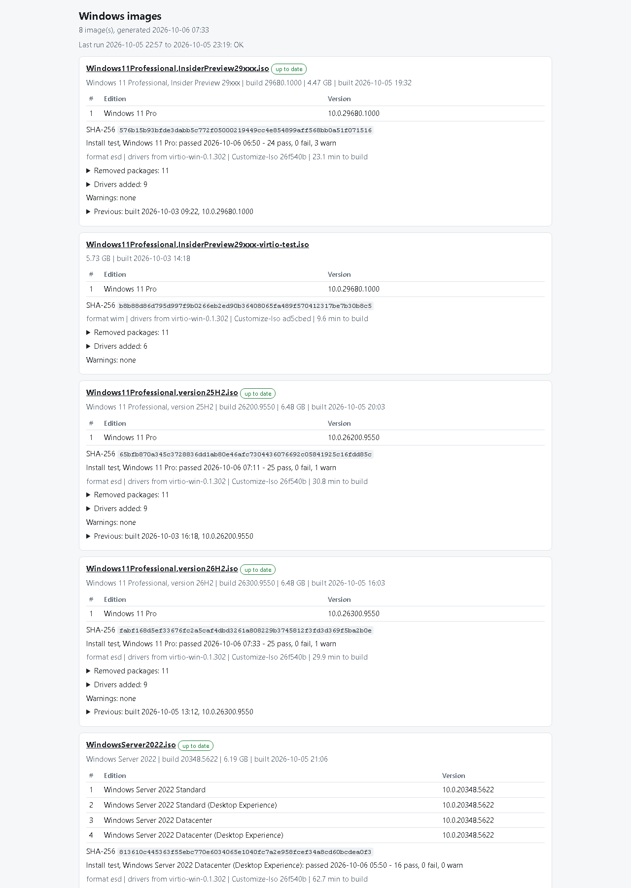

# The weekly pipeline

## The task

`register-task.ps1` registers one scheduled task, **Weekly Windows Image Build**, running as SYSTEM
on Wednesdays at 01:00. Its actions run in order, each after the previous one finishes:

1. `Y:\src\Get-WindowsIso\stub.ps1`: downloads and builds new Windows builds into `Y:\Images\Standard`.
2. `runner.ps1`: customizes whatever changed into `Y:\Images\Customized`.
3. `ci\Invoke-ImageTests.ps1` (with `-InstallTests`): installs the new ISOs on the Proxmox test node.
4. `Send-BuildNotification.ps1`: one message about all of it.

```powershell
cd Y:\src\Customize-WindowsIso
.\register-task.ps1 -GetWindowsIsoPath Y:\src\Get-WindowsIso -InstallTests
```

Options: `-DayOfWeek`, `-At`, `-TimeLimitHours` (default 30: a week where every image changes
takes ~7 h to download, ~4 h to customize and ~2.5 h to test), `-NoNotification`. Run it again
after changing them; it replaces the task. To run it now: `Start-ScheduledTask 'Weekly Windows Image Build'`.

## What gets rebuilt

`runner.ps1` rebuilds an ISO only when something that affects it changed. Its **fingerprint**
covers the source ISO (SHA-256), `Customize-Iso.ps1`, `config.json`, `autounattend.xml`, the stubs,
the disk picker files, the driver sets (the virtio-win ISO, driver folders), the Defender
platform/engine version and the WinGet release. So in a normal week:

- a new Windows build from Get-WindowsIso rebuilds that ISO;
- a monthly Defender platform/engine release, a new WinGet release, or any change to the config
  or scripts rebuilds every ISO;
- otherwise nothing is rebuilt (`UpToDate`), and the run takes a minute.

`.\runner.ps1 -Force` rebuilds everything. ISOs are built one at a time (DISM and uupdump don't
like company); a Windows 11 image takes ~25-30 min (ESD), Server ISOs with four editions ~60 min.

**Previous builds**: the ISO being replaced is kept as `<name>.previous.iso` (`KeepPrevious`).
To roll back, copy it over the current one, or just use it.

**Failures**: a failed build leaves the previous ISO in place and its working directory for
troubleshooting; the next run cleans up.

## Post-install media and Office

After the ISOs, the runner refreshes the Office cache (the newest build of the configured
channel; ~3.7 GB, only when Microsoft published a new one) and rebuilds `postinstall-client.iso`,
`postinstall-server.iso` and the `postinstall\` folder when their contents changed. Office updates
don't rebuild the Windows ISOs.

## The index page

`index.html` on the share lists every ISO: editions and versions, source build, size, build date,
SHA-256, what was removed, drivers, warnings, the last run's status, the previous build, and the
last install test of each edition. It's self-contained and links to the ISOs relative to
itself, so it works straight from `\\<build box>\Customized\index.html`.



## Notifications

`Send-BuildNotification.ps1` sends one message per run, e.g. *Windows images: OK (2 rebuilt,
3 install-tested)* or *Windows images: FAILED (1 failed)*, with what was rebuilt, new Windows
builds, install-test results, durations and warnings. A stage that didn't report (summary missing
or older than `MaxSummaryAgeHours`) counts as failed.

Set it up once, on the build box, elevated:

1. Copy `notify.example.json` to `notify.json` and fill it in. Each channel has `Enabled` and
   `Send` (`Always` or `OnlyOnFailure`):
   - `Ntfy`: `Server` (default `https://ntfy.sh`) and `Topic` (on the public server anyone who
     knows the topic can read it: use a long random name, or a protected topic with a token).
   - `Email`: an authenticated SMTP relay on port 587 with STARTTLS (`SmtpServer`, `From`, `To`,
     `Username`); Microsoft 365 needs SMTP AUTH enabled for the mailbox.
   - `Link`: opened when the ntfy notification is tapped, e.g. the index page.
2. Store the secrets (they are prompted for, never shown, and encrypted for this machine only):

   ```powershell
   .\Set-NotificationSecret.ps1 -Name SmtpPassword
   .\Set-NotificationSecret.ps1 -Name NtfyToken     # only for a protected topic
   ```

3. `.\Send-BuildNotification.ps1 -Test` sends a test message; `-DryRun` only prints it.

Until `notify.json` exists the step does nothing.

## Logs

All in `Y:\IsoBuild\Logs` (pruned after 90 days):

| File | From |
|---|---|
| `runner-<time>.log`, `last-run-runner.json` | the runner: what it did, per ISO |
| `Customize-<iso>-<time>.log` | one ISO's build (DISM's own log is in the working directory) |
| `ci-<time>.log`, `last-run-ci.json`, `ci\<iso>-<time>\` | the install tests ([details](install-tests.md)) |
| `notify-<time>.log` | the notification |

Get-WindowsIso logs to `Y:\src\Get-WindowsIso\logs`.

## Space

`Y:` needs room for the source ISOs (~60 GB), the customized ISOs and their previous copies
(~110 GB), the working directory (~40 GB during a build) and the caches (Office ~4 GB, Defender
~0.5 GB, WinGet ~0.3 GB). `DeleteSourceAfterBuild` saves the ~60 GB of sources, but then any
change to the config or scripts means downloading every image again (7-8 h); leave it off while
the configuration is still changing.
